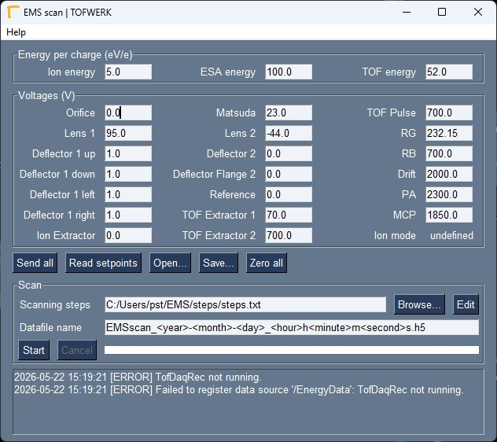

# EMS scan

<!-- badges: start -->
[](https://www.repostatus.org/#inactive)
<!-- badges: end -->

DAQ and control software for energy scanning measurements with the EMS instrument.
Based on the TOFWERK TofDaq API and PySimpleGUI.



## How to run
Double-click ems_scan.pyw
or
```
python ems_scan.pyw
```

## How to build a binary

```
pyinstaller --onefile --windowed --clean --distpath './build'  ems_scan.spec
```

## Documentation
n/a

## Release notes
n/a
